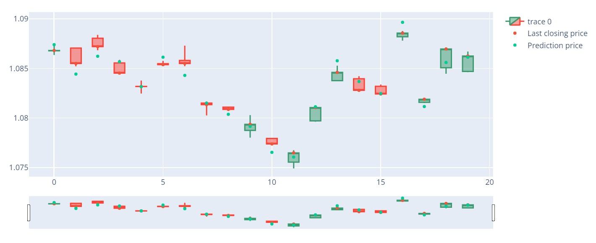

**Project Descriptions**

Forex, or foreign exchange, is a global marketplace where currencies are bought and sold. It is the largest and most liquid financial market, with a daily trading volume reaching trillions of dollars. Forex trading involves speculating on the fluctuations in exchange rates between different currency pairs, such as EUR/USD (Euro/US Dollar), GBP/JPY (British Pound/Japanese Yen), and others.

EUR/USD is one of the most actively traded currency pairs in the forex market, representing the exchange rate between the Euro, the official currency of the Eurozone, and the US Dollar, the official currency of the United States. It is considered a major currency pair due to its significant share of the total forex trading volume.

The exchange rate between EUR and USD is influenced by various factors, including economic indicators, political events, central bank policies, and market sentiment. Traders and investors analyze historical price data and use technical and fundamental analysis techniques to predict future movements in the EUR/USD exchange rate. Time series analysis and forecasting methods are commonly employed in forex trading to make informed trading decisions. In this project, I will be focusing on basic time series prediction for EUR/USD currency.
